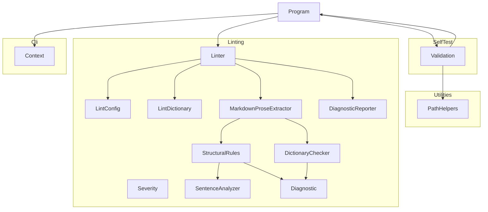

# Ste100Mark

## Architecture

The Ste100Mark is a command-line application built on .NET. It is structured as one
system containing one top-level unit (`Program`) and four subsystems (`Cli`, `Linting`,
`SelfTest`, and `Utilities`):

`Program` is the entry point. It creates a `Context` from the `Cli` subsystem,
dispatches to `Validation.Run` when `--validate` is passed, dispatches to `Linter.Run`
otherwise, and returns the exit code from `Context`. `Validation` is therefore a distinct
Program dispatch mode, not a recursive call path back into `Program`; within its own workflow
it may create additional `Context` instances and invoke `Program.Run` to exercise specific
behaviors during self-testing. `Validation` also uses `PathHelpers` to construct safe
temporary file paths. Output ownership is shared through the supplied `Context`: `Program`
writes banner, help, and version text through `context.WriteLine`; `Validation` writes
validation progress, summaries, and failures through the same context; and `Linter` writes
diagnostics and summaries through `DiagnosticReporter` into that context's output channels.

## External Interfaces

**Command-Line Interface**: The primary input interface for tool invocation.

- *Type*: CLI.
- *Role*: Consumer (the host environment invokes the system with command-line arguments).
- *Contract*: Accepts positional Markdown glob arguments `[globs...]` plus
  `-v`/`--version`, `-?`/`-h`/`--help`, `--silent`, `--validate`, `--results <file>`,
  `--result <file>` (legacy alias for `--results`), `--depth <n>`, `--log <file>`,
  `--config <file>`, `--format <text|json>`, and `--strict`. Returns exit code 0 when no
  failure condition is detected, and exit code 1 for invalid arguments, configuration or
  dictionary load failures, any error-severity lint finding, or warn-severity findings when
  `--strict` is active.
- *Constraints*: Unknown flags are rejected. Positional globs replace the configured
  `include`/`exclude` file-selection patterns for that invocation.

**Standard Output**: Normal program output written to `Console.Out`.

- *Type*: Standard I/O.
- *Role*: Provider.
- *Contract*: Writes version, banner, help text, validation summary, text diagnostics, or a
  single JSON diagnostic document depending on the selected execution path. Text-mode lint
  output emits one line per diagnostic followed by a summary line.
- *Constraints*: When `--format json` is used for linting, banner output is suppressed so
  stdout contains exactly one parseable JSON document.

**Standard Error**: Error message output written to `Console.Error`.

- *Type*: Standard I/O.
- *Role*: Provider.
- *Contract*: Writes expected errors such as invalid arguments, configuration-file failures,
  dictionary-file failures, validation-output failures, and the final text-mode lint failure
  summary.
- *Constraints*: Suppressed when `--silent` is active. In JSON lint mode, additional error
  lines are intentionally avoided so machine consumers can parse the single JSON document.

**Log File**: Optional persistent output file.

- *Type*: File.
- *Role*: Provider.
- *Contract*: When `--log <file>` is supplied, all `Context.WriteLine` and `Context.WriteError`
  output is written to the file regardless of `--silent`. The file is truncated at open.
- *Constraints*: The path must be writable; failure to open the file raises an
  `InvalidOperationException` and causes exit code 1.

**Results File**: Optional self-validation results file.

- *Type*: File.
- *Role*: Provider.
- *Contract*: When `--results <file>` is supplied alongside `--validate`, self-validation
  results are serialized to the file. Extension `.trx` selects MSTest TRX format; `.xml`
  selects JUnit XML format.
- *Constraints*: Any other extension causes an error message and exit code 1; no file is
  written.

**Lint Configuration File**: Optional YAML file controlling lint scope and rule tuning.

- *Type*: File.
- *Role*: Consumer.
- *Contract*: When `--config <file>` is supplied, the file is parsed as the `LintConfig`
  schema. When `--config` is omitted, `.ste100mark.yaml` in the current working directory is
  loaded only if present; otherwise built-in defaults are used.
- *Constraints*: The file must exist and parse as valid YAML when explicitly selected.
  Relative dictionary-file paths inside the configuration are resolved from the configuration
  file's directory.

**Project Dictionary File**: Optional YAML vocabulary file referenced by
`dictionary.file`.

- *Type*: File.
- *Role*: Consumer.
- *Contract*: When configured, the file is loaded into the effective lint dictionary and
  merged over the embedded baseline dictionary before inline allow/disallow/ignore lists are
  applied.
- *Constraints*: The file must exist and parse as valid YAML. The effective dictionary is
  case-insensitive and term based.

> **Dictionary notice:** The embedded default dictionary is a small, originally-authored,
> representative example. It is **not** the official ASD-STE100 Part 2 Dictionary.
> Projects that require true ASD-STE100 Issue 9 compliance must supply your
> organization's licensed ASD-STE100 dictionary through dictionary.file.

## Dependencies

- **DemaConsulting.TestResults**: provides `TestResults`, `TestResult`, and `TestOutcome` for
  accumulating self-validation results.
- **DemaConsulting.TestResults.IO**: provides `TrxSerializer` and `JUnitSerializer` for writing
  results files.
- **YamlDotNet**: provides YAML deserialization for `.ste100mark.yaml` and project dictionary
  files. See *YamlDotNet*.
- **Microsoft.Extensions.FileSystemGlobbing**: provides glob evaluation for file selection and
  mode overrides. See *Microsoft.Extensions.FileSystemGlobbing*.

## Risk Control Measures

N/A - not a safety-classified software item.

## Data Flow

1. The host environment starts the tool process and passes command-line arguments to
   `Program.Main`.
2. `Program.Main` calls `Context.Create(args)`, which parses the arguments and opens the log
   file if `--log` was specified. An `ArgumentException` or `InvalidOperationException` at
   this point is caught, written to stderr, and causes exit code 1.
3. `Program.Run(context)` inspects the parsed flags and dispatches to one handler:
   - `--version` flag → `context.WriteLine(Version)`, then return.
   - Otherwise, `PrintBanner` is called first unless linting JSON output was requested; then:
     - `--help` flag → `PrintHelp(context)`, then return.
     - `--validate` flag → `Validation.Run(context)`.
     - No action flag → `Linter.Run(context)`.
4. `Linter.Run` resolves the effective configuration path, loads `LintConfig`, loads the merged
   `LintDictionary`, resolves the Markdown file set, extracts prose segments, evaluates
   structural and dictionary rules, and reports diagnostics through `DiagnosticReporter`.
5. `Validation.Run` or `Linter.Run` drives `Context.ExitCode` by calling `WriteError` or
   `MarkFailure` when a failure condition is detected.
6. `Program.Main` returns `context.ExitCode` (0 if no errors were reported, 1 otherwise).

## Design Constraints

- Platform: multi-targets net8.0, net9.0, and net10.0 framework compatibility specifications
  on Windows, Linux, and macOS.
- Threading: single-threaded console application; no shared mutable state between invocations.
- Immutability: `Context` properties are set once at construction via `init` accessors and are
  read-only thereafter.
- Resource lifecycle: `Context` implements `IDisposable`; callers must dispose it to flush and
  close any open log file handle.
- Path safety: all caller-supplied path components are validated by `PathHelpers.SafePathCombine`
  before file-system use in the self-validation workflow.
- Configuration format: lint configuration and project dictionary files use YAML parsed through
  YamlDotNet's hyphenated naming convention.
- File selection semantics: include, exclude, and override pattern matching uses
  Microsoft.Extensions.FileSystemGlobbing matcher semantics relative to the current working
  directory or configuration directory, as applicable.
