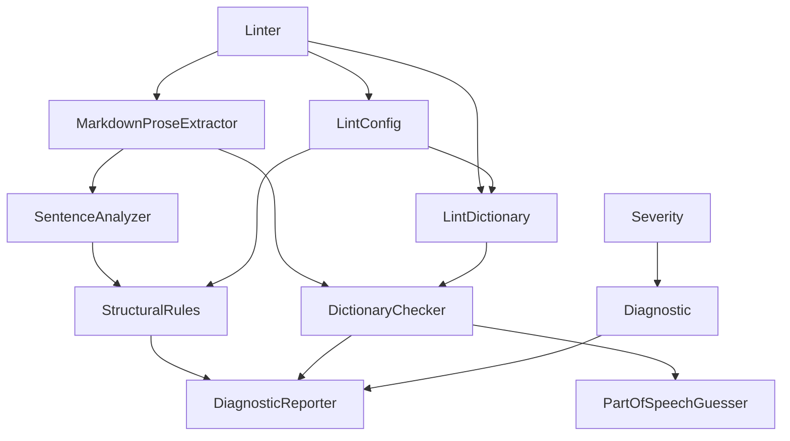

## Linting

### Purpose

The `Linting` subsystem performs the tool's Markdown prose analysis for ASD-STE100-style
writing. It loads the effective lint configuration and dictionary, selects the Markdown
files in scope, extracts prose from each file, evaluates structural and vocabulary rules,
and reports the aggregated diagnostics in text or JSON format. Its role in Ste100Mark is to
provide the primary command-path implementation behind the default lint workflow exposed
through `Linter.Run`.

### Overview

The subsystem contains one orchestration unit (`Linter`), one reporting unit
(`DiagnosticReporter`), four analysis units (`MarkdownProseExtractor`, `SentenceAnalyzer`,
`StructuralRules`, and `DictionaryChecker`), two configuration/data units (`LintConfig` and
`LintDictionary`), one heuristic helper (`PartOfSpeechGuesser`), and two supporting value
types (`Diagnostic` and `Severity`). Together they convert raw Markdown input into
deterministic lint findings aligned with the tool's official STE100 rule checks and
advisory heuristics.

The source folder contains nine primary behavioral units plus two supporting value types:

- `Severity` - closed severity set (`Off`, `Warn`, `Error`) shared by configuration and
  diagnostics.
- `Diagnostic` - immutable finding record carrying file, location, rule code, severity,
  message, and optional suggestion.
- `LintConfig` - YAML-backed configuration model for file selection, mode overrides, rule
  tuning, and dictionary settings.
- `LintDictionary` - merged effective dictionary built from the embedded baseline,
  project-supplied dictionary file, and inline allow/disallow/ignore lists, with each term
  carrying one or more part-of-speech-tagged senses.
- `PartOfSpeechGuesser` - lightweight, deterministic regex/rule-based heuristic that
  guesses whether a matched term is used as a noun or a verb at its match site, used to
  select the applicable sense(s) of a multi-sense dictionary entry.
- `MarkdownProseExtractor` - line-based Markdown extractor that keeps headings, list items,
  table cells, and paragraphs, removing fenced code blocks and link destinations while
  retaining inline code spans verbatim.
- `SentenceAnalyzer` - sentence splitter and rule-aware word counter for Rules 4.1 and
  8.4-8.7.
- `StructuralRules` - official Rule 4.1, Rule 8.1, and Rule 4.2 enforcement plus advisory
  paragraph-length, passive-voice, complex-verb (perfect/modal-perfect tense), and `-ing`
  form heuristics.
- `DictionaryChecker` - case-insensitive whole-term vocabulary checker using the effective
  merged dictionary and `PartOfSpeechGuesser` sense selection.
- `DiagnosticReporter` - formatter for text and JSON diagnostic output.
- `Linter` - orchestration entry point that ties the subsystem together and drives the exit
  code.

The unit design details for the subsystem are documented in the companion unit files in
this folder: *Diagnostic Design*, *DiagnosticReporter Design*, *DictionaryChecker Design*,
*LintConfig Design*, *LintDictionary Design*, *Linter Design*, *MarkdownProseExtractor
Design*, *PartOfSpeechGuesser Design*, *SentenceAnalyzer Design*, *Severity Design*, and
*StructuralRules Design*.

> **Dictionary notice:** The embedded default dictionary in
> `src/DemaConsulting.Ste100Mark/Linting/DefaultDictionary.yaml` is a small,
> originally-authored, representative example. It is **not** the official ASD-STE100 Part 2
> Dictionary. Each term carries one or more part-of-speech-tagged senses (noun/verb/
> adjective/adverb/any); a term with a single sense is always reported directly, while a
> multi-sense term is disambiguated by `PartOfSpeechGuesser` at lint time. Projects that
> require true ASD-STE100 Issue 9 compliance must supply your organization's licensed
> ASD-STE100 dictionary through `dictionary.file`, and should set
> `dictionary.use-embedded: false` to avoid mixing illustrative content with licensed
> vocabulary.

### Interfaces

**Linter.Run**: Executes one complete lint pass.

- *Type*: In-process .NET static method.
- *Role*: Provider.
- *Contract*: Accepts a parsed `Context`. Resolves the configuration path, loads
  `LintConfig`, loads the effective `LintDictionary`, resolves the Markdown file set,
  extracts prose segments, evaluates structural and dictionary rules, reports the
  aggregated `Diagnostic` list through `DiagnosticReporter`, and sets the exit code through
  `Context.WriteError` or `Context.MarkFailure` when a failure condition is present.
- *Constraints*: Throws `ArgumentNullException` for a null `Context`. Configuration and
  dictionary load failures are caught within `Linter.Run` and converted into reported
  errors instead of propagating to `Program.Main`.

### Design

`Linter.Run` is the subsystem's only entry point. Its collaboration sequence is:

1. `LintConfig.Load` resolves the effective YAML configuration, including include/exclude
   globs, default writing mode, override globs, rule tuning, and dictionary options.
2. `LintDictionary.Load` merges the embedded illustrative dictionary (unless disabled),
   the optional project dictionary file, inline `disallow` entries, and the
   `allow`/`ignore` removal lists.
3. `Linter.ResolveFiles` computes the Markdown file set. Positional globs from the command
   line replace configured include/exclude patterns; otherwise the configuration controls
   the scope.
4. For each file, `MarkdownProseExtractor.Extract` emits prose segments in document order.
   `SentenceAnalyzer.Split` then interprets those segments for Rule 4.1 word-limit and
   advisory paragraph/passive checks. `DictionaryChecker.Evaluate` inspects the same
   segment text against the merged dictionary.
5. `StructuralRules.Evaluate` and `DictionaryChecker.Evaluate` each return immutable
   `Diagnostic` values. `DiagnosticReporter.Report` formats the aggregated list either as
   line-oriented text or as one JSON document.
6. `Linter` applies exit-code semantics: error-severity diagnostics always fail the run;
   warn-severity diagnostics also fail when `--strict` is active.

The subsystem reports the following rule codes:

- `STE100-4.1` - Sentence word-count limit, using the counting rules implemented for Rules
  8.4-8.7. Official STE100 rule.
- `STE100-8.1` - Semicolon prohibition in prose. Official STE100 rule.
- `STE100-4.2` - Contraction prohibition in prose. Official STE100 rule.
- `STE100-ADV-PARA` - Paragraph sentence-count cap. Advisory heuristic; not an official
  STE100 rule.
- `STE100-ADV-PASSIVE` - Passive-voice detection (`to be` + past participle heuristic).
  Advisory heuristic; not an official STE100 rule.
- `STE100-ADV-COMPLEXVERB` - Perfect and modal-perfect tense detection. Advisory
  heuristic; not an official STE100 rule.
- `STE100-ADV-INGFORM` - `-ing` form detection. Advisory heuristic; not an official
  STE100 rule.
- `STE100-DICT` - Effective dictionary/disallow-list enforcement. Tool-defined dictionary
  check; reported as an error.

`STE100-4.1`, `STE100-8.1`, and `STE100-4.2` are always emitted at error severity when the
corresponding check is enabled. `STE100-ADV-PARA` emits a warning when
`rules.max-sentences-paragraph` is greater than zero and a paragraph exceeds the
configured cap. `STE100-ADV-PASSIVE` emits at the severity configured by
`rules.passive-voice`. `STE100-ADV-COMPLEXVERB` emits at the severity configured by
`rules.complex-verb`, and `STE100-ADV-INGFORM` emits at the severity configured by
`rules.ing-form`. `STE100-DICT` depends on the effective dictionary content; when a
project provides its own licensed dictionary file, that file becomes the authoritative
vocabulary source for the subsystem.
